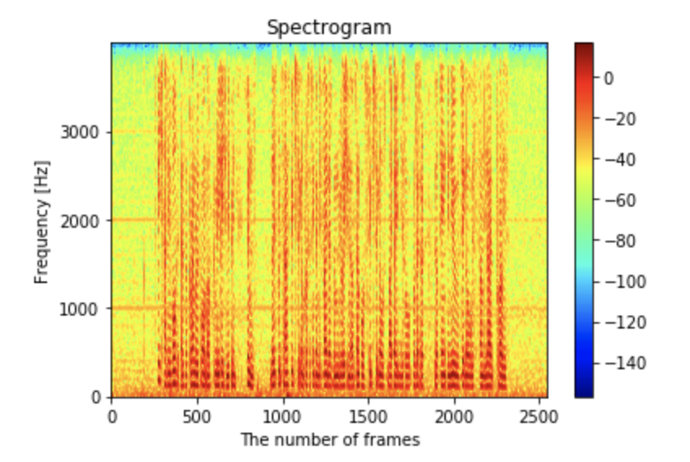

# Fourier_Transform
implement Short-Time Fourier Transform from scratch
This repo contains:
 - File wav as input file
 - fft.py implements fft for 2-d signal
 - STFT.ipynb run STFT and view result

Please check it out

  
  
STFT spectrogram example

